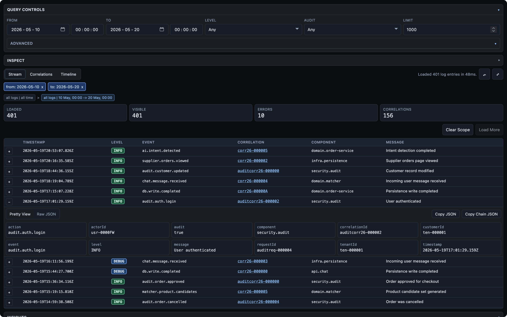

MikroScope is a small observability product for services that write structured NDJSON logs.

The API sidecar ingests logs, indexes them into SQLite, exposes query and aggregate endpoints, serves OpenAPI documents, and evaluates alert policies. It is useful on its own and does not serve the browser console.

:::tip[Primary Distribution]
Use the [mikroscope npm package](https://www.npmjs.com/package/mikroscope) to run the logging sidecar in most Node deployments. Release ZIPs are useful for pinned server deployments and the static console bundle.
:::

MikroScope Console is a static frontend that points at the API. It is distributed and deployed as static files, so you can host it with Caddy, a CDN, object storage, or any static server.

:::tip[Related: MikroAPM]
MikroScope handles log ingestion, search, and investigation. Use [MikroAPM](https://mikrosuite.com/apm) when you also want uptime checks, alerts, and a public status dashboard.
:::

This mirrors the newer Mikro product model: API and frontend are freestanding surfaces, while product build and deployment scripts can package them together for convenience.
